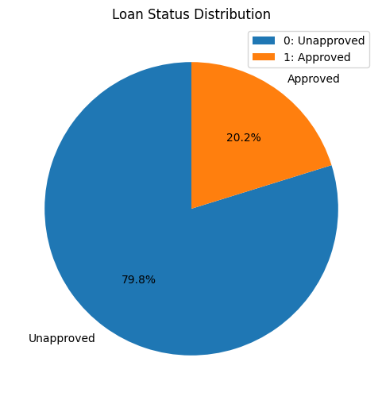
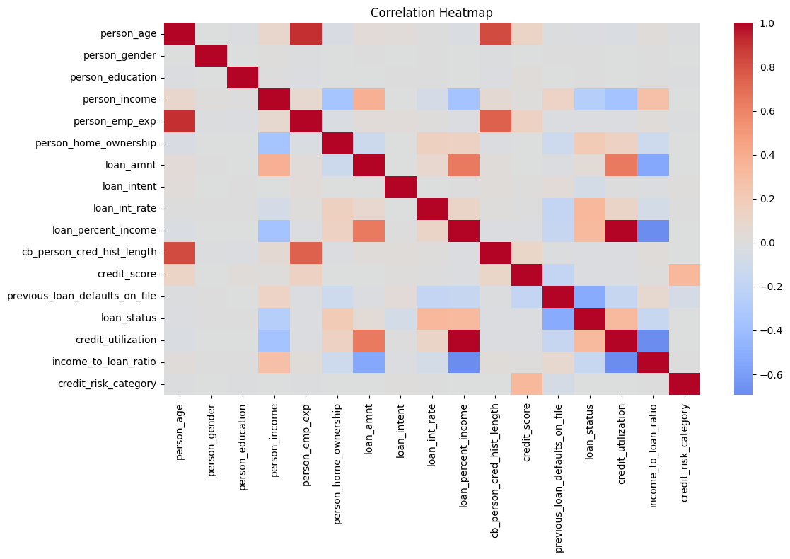
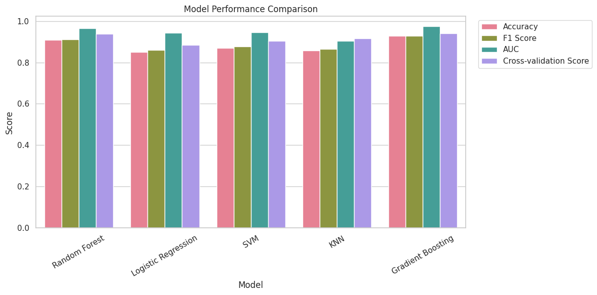
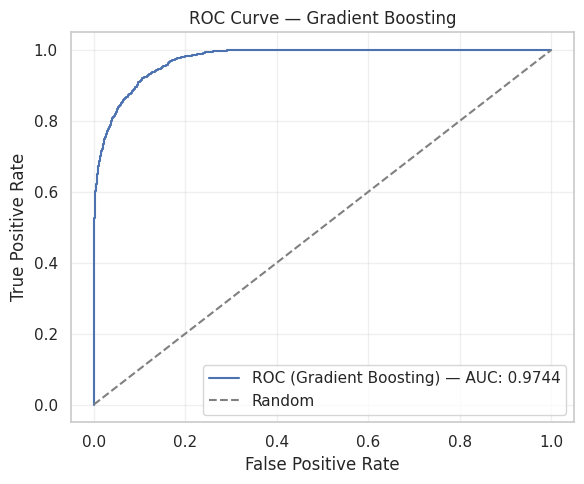
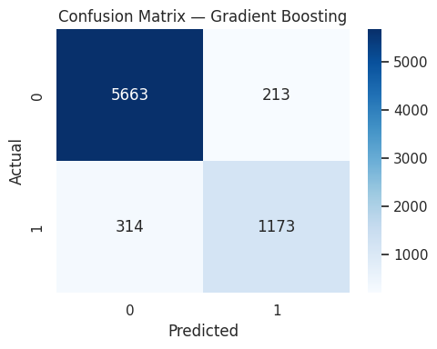
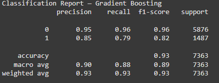

  

<h1 align="center">Loan Approval Prediction</h1>
<h3 align="center">CRISP-DM Machine Learning Portfolio</h3>

  
  
  
  

---

<table align="center">
  <tr>
    <td width="1200">
      <h2 align="center">📌 Business Understanding</h2>
      

        Proyek ini berfokus pada permasalahan <strong>persetujuan pinjaman (loan approval)</strong> yang umum dihadapi oleh institusi keuangan.
        Keputusan kredit yang tidak akurat dapat menyebabkan <strong>risiko gagal bayar</strong> atau <strong>kehilangan calon nasabah potensial</strong>.
      

      

        Tujuan utama dari proyek ini adalah membangun <strong>model klasifikasi yang akurat, stabil, dan seimbang</strong> untuk membantu
        pengambilan keputusan kredit berbasis data.
      

<h4>🎯 Business Objectives</h4>
<ul>
  <li>Memprediksi status persetujuan pinjaman (Approved / Unapproved)</li>
  <li>Menangani data imbalance secara profesional</li>
  <li>Menyediakan model yang siap untuk deployment</li>
</ul>

<h4>📈 Success Metrics</h4>
<ul>
  <li>F1-Score (Weighted)</li>
  <li>ROC-AUC</li>
  <li>Stabilitas cross-validation</li>
  <li>Interpretabilitas fitur</li>
</ul>
    </td>
  </tr>
</table>

---

<table align="center">
  <tr>
    <td width="1200">
      <h2 align="center">📊 Data Understanding</h2>

<strong>Dataset:</strong> <code>loan_data.csv</code>

<strong>Target Variable:</strong> <code>loan_status</code> (0 = Unapproved, 1 = Approved)

<h4>Key Features</h4>
<ul>
  <li><code>person_age</code></li>
  <li><code>person_income</code></li>
  <li><code>credit_score</code></li>
  <li><code>loan_amnt</code></li>
  <li><code>loan_int_rate</code></li>
  <li><code>loan_percent_income</code></li>
</ul>

  

    </td>
  </tr>
</table>

---

<table align="center">
  <tr>
    <td width="1200">
      <h2 align="center">🛠️ Data Preparation</h2>

<ul>
  <li><strong>Outlier Treatment:</strong> IQR-based trimming</li>
  <li><strong>Imbalance Handling:</strong> SMOTE</li>
  <li><strong>Scaling:</strong> RobustScaler</li>
  <li><strong>Feature Engineering:</strong>
    <ul>
      <li>Credit Utilization</li>
      <li>Income-to-Loan Ratio</li>
      <li>Credit Risk Category</li>
    </ul>
  </li>
</ul>

  

    </td>
  </tr>
</table>

---

<table align="center">
  <tr>
    <td width="1200">
      <h2 align="center">🤖 Modeling</h2>

Beberapa algoritma Machine Learning diuji dan dibandingkan:

<ul>
  <li>Logistic Regression</li>
  <li>Random Forest</li>
  <li>Gradient Boosting</li>
  <li>Support Vector Machine (SVM)</li>
  <li>K-Nearest Neighbors (KNN)</li>
</ul>

Seluruh model dituning menggunakan <strong>GridSearchCV</strong> dengan
<strong>5-Fold Cross Validation</strong> untuk memastikan generalisasi model.

    </td>
  </tr>
</table>

---

<table align="center">
  <tr>
    <td width="1200">
      <h2 align="center">✅ Evaluation</h2>

  

  

  

  

Model terbaik dipilih berdasarkan keseimbangan antara <strong>Recall</strong>,
<strong>Precision</strong>, dan <strong>ROC-AUC</strong>.

    </td>
  </tr>
</table>

---

<table align="center">
  <tr>
    <td width="1200">
      <h2 align="center">🚀 Deployment & Next Steps</h2>

<ul>
  <li>Menyimpan model dan scaler menggunakan <code>joblib</code></li>
  <li>Deploy melalui <strong>Flask / FastAPI</strong></li>
  <li>Monitoring data drift dan imbalance baru</li>
  <li>Menambahkan explainability dengan <strong>SHAP / Permutation Importance</strong></li>
</ul>
    </td>
  </tr>
</table>

---

<strong>📌 This project is designed as a production-ready Machine Learning portfolio using CRISP-DM.</strong>

